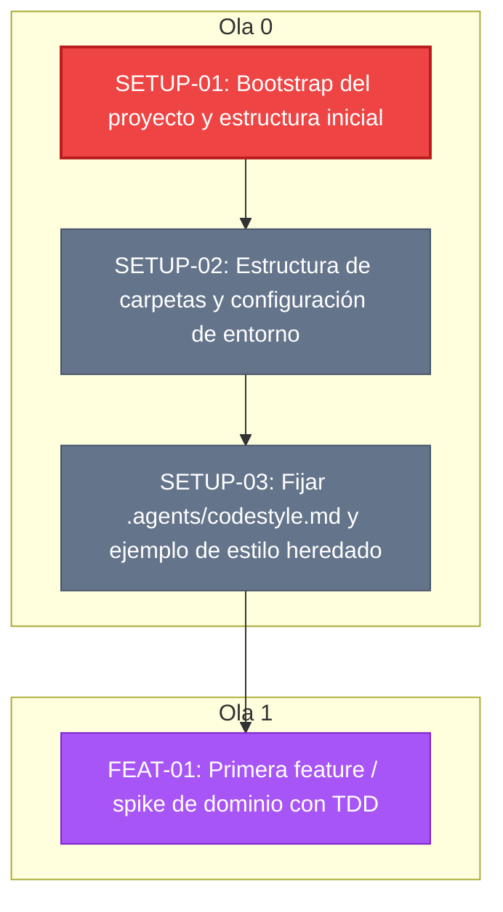

# TASKS.md — Seguimiento de Tareas

> Vista generada automáticamente a partir de `tasks.yaml` (SSOT).
> **No edites este archivo a mano.** Usa `just task <cmd>` o edita `tasks.yaml`.

**Progreso general:** `[░░░░░░░░░░░░░░░░░░░░] 0% (0/4)`

| Estado | Cantidad | Descripción |
|---|---|---|
| 🟢 **Hechas** | 0 | Verificadas por el humano |
| 🔵 **En revisión** | 0 | Terminadas por el worker, listas para verificar |
| 🟠 **En curso** | 0 | En desarrollo activo (WIP=1) |
| 🔴 **To Do** | 1 | Aprobadas y desbloqueadas, listas para tomar |
| ⬜ **Bloqueadas** | 2 | Esperando dependencias no completadas |
| 🟣 **Propuestas** | 1 | Propuestas, esperando aprobación |

---

## Detalle de Tareas por Fase

### Fase / Ola 0

| ID | Estado | Área | Título | Dependencias |
|---|---|---|---|---|
| `SETUP-01` | 🔴 to_do | Setup | Bootstrap del proyecto y estructura inicial | *(ninguna)* |
| `SETUP-02` | ⬜ blocked | Setup | Estructura de carpetas y configuración de entorno | `SETUP-01` |
| `SETUP-03` | ⬜ blocked | Setup | Fijar .agents/codestyle.md y ejemplo de estilo heredado | `SETUP-02` |

### Fase / Ola 1

| ID | Estado | Área | Título | Dependencias |
|---|---|---|---|---|
| `FEAT-01` | 🟣 proposed | Core | Primera feature / spike de dominio con TDD | `SETUP-03` |

---

## Grafo de Dependencias (Mermaid)

