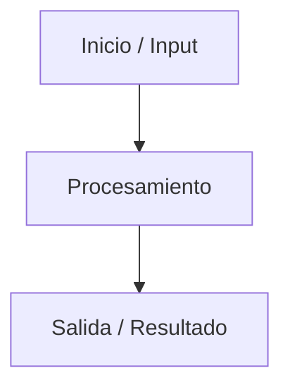

# Fase 3 — Arquitectura y Modelado (Diagramas UML & Flujos)

**Proyecto**: [Nombre del proyecto]
**Tamaño del proyecto**: [ ] Chico &nbsp; [ ] Mediano &nbsp; [ ] Grande

> **Nivel de detalle según tamaño** (Guía de Escalamiento):
> - **Chico**: solo el flowchart simple, nada de UML formal. Borra el resto de las secciones de este documento.
> - **Mediano**: DER básico + 1 diagrama de flujo. Casos de uso solo si hay más de 2 tipos de usuario.
> - **Grande**: DER completo, casos de uso, diagrama de secuencia si hay APIs externas.

> Utiliza bloques de Mermaid (````mermaid ... ````) o imágenes en `docs/diagrams/`.

---

## 1. Diagrama de Flujo / Proceso

*(Obligatorio en todos los tamaños)*

¿Cómo viaja la información desde el origen hasta el destino?



[Si aún no tienes el diagrama gráfico, anota el flujo en texto:
Usuario -> Formulario -> Validación -> Base de Datos -> Notificación]

---

## 2. Modelo de Datos / DER

*(Solo Mediano y Grande — omitir si el proyecto es Chico)*

### 2.1 Diagrama Entidad-Relación
[Insertar imagen/link del DER]

### 2.2 Tablas

#### Tabla: [nombre_tabla]
- **Descripción**: [propósito de la tabla]
- **Llave Primaria (PK)**: [columna]

| Columna | Tipo de dato | Nulo | PK/FK | Descripción |
|---|---|---|---|---|
| [columna1] | [tipo] | [Sí/No] | [PK/FK] | [descripción] |
| [columna2] | [tipo] | [Sí/No] | | [descripción] |

**Relaciones**: [Ej: `user_id` es FK que referencia la tabla `users`]

*(Repetir bloque de tabla por cada entidad relevante)*

---

## 3. Casos de Uso

*(Mediano: solo si hay más de 2 tipos de usuario · Grande: siempre)*

| Actor | Caso de uso | Descripción breve |
|---|---|---|
| [Rol] | [Acción] | [Qué logra el usuario] |

---

## 4. Diagrama de Secuencia

*(Solo Grande, o Mediano si hay integración con APIs externas)*

Orden en el tiempo de las llamadas entre componentes.

[Insertar imagen/link del diagrama de secuencia]

---

## 5. Módulos / Servicios necesarios

¿Qué módulos o librerías independientes necesito para armar esta solución?

- [Librería/módulo 1] — [para qué]
- [Librería/módulo 2] — [para qué]

---

## 6. Dónde y cómo se almacena la información

[Motor de BD, servicio de storage, estructura de archivos, etc.]

---

## Checklist de cierre de Fase 3

- [ ] Diagrama de flujo principal hecho
- [ ] DER y tablas documentadas *(si aplica al tamaño)*
- [ ] Casos de uso cubiertos *(si aplica)*
- [ ] Diagrama de secuencia hecho *(si aplica)*
- [ ] Librerías/módulos clave identificados
